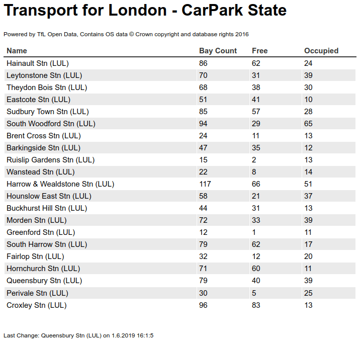

# kafka-tfl-webnotification
Simple Spring Boot WebUI for the London CarPark State. Data is read from Kafka using Spring Kafka. As a simple producer you can use the [Kafka Tfl Connector](https://github.com/christofluethi/kafka-tfl-connector). 

Data consumed by this connector is powered by TfL Open Data.

# Web UI
The UI is updated in realtime using a WebSocket.

